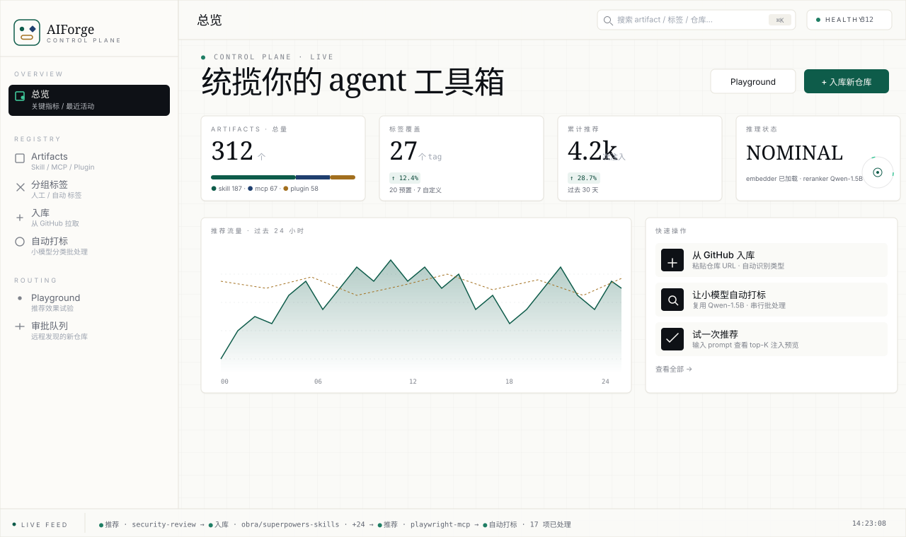
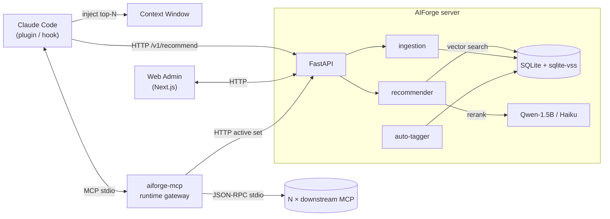

<div align="center">

<a href="https://github.com/sheep-programmer/AIForge">
  
</a>

<br/>

<p>
  <a href="https://github.com/sheep-programmer/AIForge/blob/main/LICENSE"></a>
  <a href="https://github.com/sheep-programmer/AIForge/actions/workflows/ci.yml"></a>
  <a href="https://github.com/sheep-programmer/AIForge/releases"></a>
  
  
  <a href="https://github.com/sheep-programmer/AIForge/issues"></a>
  
</p>

<p>
  <a href="README.md"><b>简体中文</b></a> ·
  <a href="#-why-aiforge">Why</a> ·
  <a href="#-quick-start">Quick Start</a> ·
  <a href="#-web-admin-console">Web Admin</a> ·
  <a href="#-how-it-works">How it works</a> ·
  <a href="#-slash-commands">Commands</a> ·
  <a href="docs/">Docs</a>
</p>

<sub>Unified registry & router for agent skills, MCP servers, and Claude Code plugins — a small model picks only the few your conversation actually needs.</sub>

</div>

---

## ✦ Why AIForge

By 2026 the Claude Code / Codex / Cursor extension ecosystem has exploded:

- `anthropics/skills`, `obra/superpowers`, `vercel-labs/skills`, `pbakaus/impeccable` — over ten thousand public skills
- `@modelcontextprotocol/server-*`, `@playwright/mcp`, countless self-hosted MCP servers — hundreds of tools exposed
- A Claude Code plugin marketplace already fragmenting

Three artifact ecosystems → three old problems:

|   | Problem | AIForge's answer |
|---|---|---|
| ① | **Token waste** — 200 skills + 30 MCP tool lists eat half your context before you say a word | A small model on the server picks top-N (default 3) per prompt |
| ② | **Capability conflicts** — three review skills / five browser-automation MCPs; agents pick at random or run them all | Vector dedupe + small-model rerank keeps one best representative per cluster |
| ③ | **Fragmented management** — skills in git, MCP in settings.json, plugins in ~/.claude/plugins/ | Unified Artifact model + one web console |

---

## ✦ Web Admin Console

<div align="center">
  <a href="docs/web-admin.en.md">
    
  </a>
  <br/>
  <sub>"Editorial Engineering" design — warm parchment + single oxide-green accent · Fraunces serif + Inter body + JetBrains Mono for data</sub>
</div>

<br/>

Nine routes, enterprise-grade density:

| Path | Contents |
|---|---|
| `/` | Dashboard · KPIs · 24h throughput · recent activity · 4-step onboarding |
| `/artifacts` | Browse all artifacts; filter by type / tag / repo; URL state shareable |
| `/artifacts/[id]` | Detail: body, metadata, tag editor, one-click copy of mcp_config, plugin manifest |
| `/tags` | 20 built-in tags + custom; per-tag usage bar |
| `/ingest` | Paste GitHub URL → live state-machine timeline |
| `/autotag` | Small-model batch tagging + progress bar + ETA + live stream |
| `/playground` | Type a prompt, see top-K + score bar + rerank reason |
| `/discovery` | Approval queue for remote-finder discoveries |
| `/settings` | API base URL / API key / default top-K / theme |

```bash
cd web
npm install
npm run dev          # → http://localhost:3500
```

The UI falls back to demo data when the backend is offline — always demoable.

---

## ✦ How it works



When the server is unreachable, the plugin silently degrades to **local fallback**: cached SQLite + keyword index keeps recommendations flowing without small-model rerank.

---

## ✦ Quick Start

### 1. Run the server

```bash
git clone https://github.com/sheep-programmer/AIForge.git aiforge
cd aiforge/server
docker compose -f docker/docker-compose.yml up -d
# HTTP API → http://localhost:8765
```

Seed it:

```bash
curl -X POST http://localhost:8765/v1/ingest \
  -H 'Content-Type: application/json' \
  -d '{"github_url": "https://github.com/obra/superpowers-skills"}'

curl -X POST http://localhost:8765/v1/ingest \
  -H 'Content-Type: application/json' \
  -d '{"github_url": "https://github.com/anthropics/skills"}'
```

Ingest auto-detects content — `.claude-plugin/plugin.json` → plugin, `mcp.json` → mcp, `SKILL.md` → skill. A single repo can produce multiple kinds.

### 2. Install the plugin (auto-inject recommendations)

```bash
cd aiforge/plugin
./install.sh --server http://localhost:8765
```

Writes a `UserPromptSubmit` hook into `~/.claude/settings.json`; drops the plugin at `~/.claude/plugins/aiforge/`.

### 3. (Recommended) Run the web admin

```bash
cd aiforge/web
npm install
npm run dev          # → http://localhost:3500
```

### 4. (Optional) MCP runtime gateway

Have Claude Code connect to one MCP that AIForge routes to N downstreams:

```jsonc
// ~/.claude/settings.json
{
  "mcpServers": {
    "aiforge": { "command": "aiforge-mcp" }
  }
}
```

On startup `aiforge-mcp` pulls the active MCP set, spawns each downstream, aggregates tools, and routes via the `<artifact_name>__<tool_name>` namespace.

---

## ✦ Key Features

<table>
<tr>
<td width="50%" valign="top">

**🗂 Unified Artifact model**
One `Skill` table; `artifact_type` discriminator carries skill / mcp / plugin; one `/v1/artifacts` API.

</td>
<td width="50%" valign="top">

**🏷 Flat multi-tag + auto-tagging**
20 built-in tags + custom. The reranker doubles as a tagger — picks 1-3 best-fit tags per artifact.

</td>
</tr>
<tr>
<td valign="top">

**⚡ Two-stage recommender**
`all-MiniLM-L6-v2` recalls top-30; Qwen2.5-1.5B (or Haiku) reranks to top-3.

</td>
<td valign="top">

**🔌 MCP runtime gateway**
`aiforge-mcp` is a single MCP server to Claude Code; aggregates N downstream MCPs by `<name>__<tool>` namespace.

</td>
</tr>
<tr>
<td valign="top">

**♻️ Auto dedupe**
Clusters semantically equivalent artifacts; keeps one best representative scored by reputation × recency × installs.

</td>
<td valign="top">

**🛠 One-click install**
Web panel or `/aiforge:install` writes MCPs into `settings.json` (with backup) and clones plugins into `~/.claude/plugins/`.

</td>
</tr>
<tr>
<td valign="top">

**🛰 Remote skill-finder** (off by default)
Scans GitHub for high-quality new repos into a **manual approval queue**.

</td>
<td valign="top">

**🪂 Local fallback**
Server down? Cached SQLite keeps the plugin working.

</td>
</tr>
</table>

---

## ✦ Slash Commands

Available after installing the plugin:

```
/aiforge:status              # server health + local cache state
/aiforge:add <github-url>    # ingest a repo
/aiforge:search <query>      # keyword search
/aiforge:sync                # pull the latest index to local cache
/aiforge:config              # view / edit plugin config
/aiforge:list [--type=...]   # list artifacts (with installed markers)
/aiforge:install <id>        # install MCP into settings.json / plugin into ~/.claude/plugins
/aiforge:uninstall <id>      # reverse of install
/aiforge:tag <id> <t1,t2>    # manually tag an artifact
/aiforge:autotag             # trigger auto-tagging with live progress
```

---

## ✦ Architecture

See [docs/architecture.en.md](docs/architecture.en.md) (English) / [docs/architecture.md](docs/architecture.md) (Chinese). Mermaid sources in [docs/diagrams/](docs/diagrams/).

| Component | Choice | Why |
|---|---|---|
| HTTP API | FastAPI + Uvicorn | async, built-in OpenAPI, mature ecosystem |
| Vector store | SQLite + sqlite-vss | zero ops, embedded, fast enough up to ~100k artifacts |
| Embedder | sentence-transformers (`all-MiniLM-L6-v2`) | 384-dim, CPU-friendly, well-benchmarked |
| Reranker / tagger | Ollama (Qwen2.5-1.5B, default) / Claude Haiku API | tiny, fast, surprisingly good at ranking |
| MCP gateway | asyncio + JSON-RPC | no extra deps; SDK migration deferred |
| Web admin | Next.js 14 + Tailwind + hand-rolled shadcn-style | static export, can be served behind FastAPI |
| Plugin | bash + Python (stdlib only) | native Claude Code, zero third-party deps |

---

## ✦ Status

```
 v0.1 ▰▰▰▰▰▰▰▰▰▰  shipped · server + recommender + ingest + plugin + fallback + remote-finder
 v0.2 ▰▰▰▰▰▰▰▰▰▰  shipped · unified artifact · tags · autotag · web admin · MCP gateway MVP
 v0.3 ▱▱▱▱▱▱▱▱▱▱  in design · gateway hot-reload · cross-agent (Codex/Cursor/Gemini) · web i18n
```

Full roadmap: [docs/roadmap.en.md](docs/roadmap.en.md)

---

## ✦ Contributing

See [CONTRIBUTING.en.md](CONTRIBUTING.en.md). Most-wanted contributions right now:

1. Real-world artifact corpora for recommendation / tagging quality tests
2. Dedup test cases
3. Reranker / tagger prompt improvements
4. Web admin i18n (English / 日本語 / Deutsch)

<div align="center">

[](https://github.com/sheep-programmer/AIForge/graphs/contributors)
[](https://github.com/sheep-programmer/AIForge/commits/main)
[](https://github.com/sheep-programmer/AIForge/issues)
[](https://github.com/sheep-programmer/AIForge/stargazers)

</div>

---

## ✦ License

Apache 2.0 — see [LICENSE](LICENSE).
