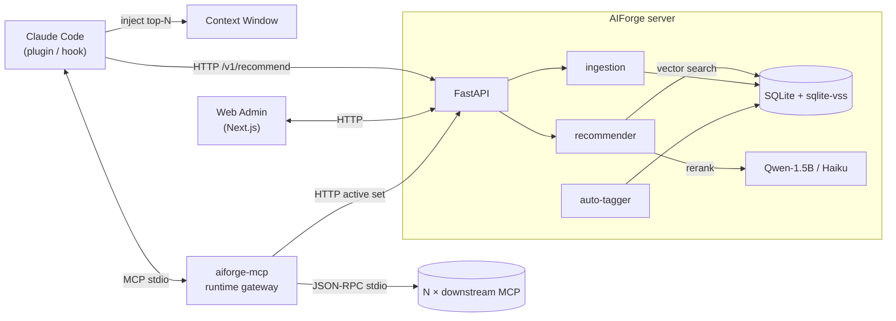

<div align="center">

<a href="https://github.com/sheep-programmer/AIForge">
  
</a>

<br/>

<p>
  <a href="https://github.com/sheep-programmer/AIForge/blob/main/LICENSE"></a>
  <a href="https://github.com/sheep-programmer/AIForge/actions/workflows/ci.yml"></a>
  <a href="https://github.com/sheep-programmer/AIForge/releases"></a>
  
  
  <a href="https://github.com/sheep-programmer/AIForge/issues"></a>
  
</p>

<p>
  <a href="README.en.md"><b>English</b></a> ·
  <a href="#-为什么需要-aiforge">为什么</a> ·
  <a href="#-快速上手">快速上手</a> ·
  <a href="#-web-管理面板">Web 面板</a> ·
  <a href="#-工作原理">工作原理</a> ·
  <a href="#-slash-命令">命令</a> ·
  <a href="docs/">完整文档</a>
</p>

<sub>Skill / MCP / Plugin 一站式注册中心 · 由小模型按需挑选 · 只把真正需要的几个注入对话上下文</sub>

</div>

---

## ✦ 为什么需要 AIForge

2026 年，Claude Code / Codex / Cursor 的扩展生态彻底爆炸：

- `anthropics/skills`、`obra/superpowers`、`vercel-labs/skills`、`pbakaus/impeccable` —— 公开 skill 过万
- `@modelcontextprotocol/server-*`、`@playwright/mcp`、各类自建 MCP server —— 暴露成百上千个 tool
- Claude Code plugin 市场刚起步但已经在分裂

三个东西凑在一起，三个老大难问题：

|   | 问题 | AIForge 的解法 |
|---|---|---|
| ① | **Token 浪费** —— 200 个 skill + 30 个 MCP 的 tool 列表塞进 context，还没开聊就烧掉一半预算 | 服务端跑小模型，每次提问只挑 top-N (默认 3) 注入 |
| ② | **功能冲突** —— 三个 review skill / 五个 browser-automation MCP；agent 要么乱挑要么全跑 | 向量去重 + 小模型重排，每簇只保留最优代表 |
| ③ | **管理割裂** —— skill 在 git、MCP 在 settings.json、plugin 在 ~/.claude/plugins/ | 统一 Artifact 模型 + 一个 Web 面板掌管 |

---

## ✦ Web 管理面板

<div align="center">
  <a href="docs/web-admin.md">
    
  </a>
  <br/>
  <sub>「Editorial Engineering」设计语言 · 暖色 parchment 底 + 单一氧化铜绿强调 · Fraunces 衬线标题 + Inter 正文 + JetBrains Mono 数据</sub>
</div>

<br/>

九条路由，全部中文，企业级密度：

| 路径 | 内容 |
|---|---|
| `/` | Dashboard · KPI · 24h 流量曲线 · 最近活跃 · 新手 4 步引导 |
| `/artifacts` | 浏览全部 artifact，按类型 / 标签 / 仓库筛选；URL state 可分享 |
| `/artifacts/[id]` | 详情：body、metadata、tag 编辑器、mcp_config 一键复制、plugin manifest |
| `/tags` | 20 个预置标签 + 自定义；artifact 使用度可视化 |
| `/ingest` | 粘贴 GitHub URL → 实时状态机时间线 |
| `/autotag` | 小模型批量打标 + 进度条 + ETA + 实时操作流 |
| `/playground` | 输入 prompt 看 top-K 推荐 + score bar + rerank 理由 |
| `/discovery` | 远程 finder 找到的高质量仓库审批队列 |
| `/settings` | API 地址 / API Key / 默认 top-K / 主题 |

```bash
cd web
npm install
npm run dev          # 默认 http://localhost:3500
```

后端不可达时，前端自动 fallback 到 demo 数据，UI 永远可演示。

---

## ✦ 工作原理



服务端不可达时，插件自动切到**本地兜底模式**：缓存的 SQLite + 关键词索引让它依然能挑出合理的 artifact，只是少了小模型重排。

---

## ✦ 快速上手

### 1. 启动服务端

```bash
git clone https://github.com/sheep-programmer/AIForge.git aiforge
cd aiforge/server
docker compose -f docker/docker-compose.yml up -d
# HTTP API → http://localhost:8765
```

种子入库：

```bash
curl -X POST http://localhost:8765/v1/ingest \
  -H 'Content-Type: application/json' \
  -d '{"github_url": "https://github.com/obra/superpowers-skills"}'

curl -X POST http://localhost:8765/v1/ingest \
  -H 'Content-Type: application/json' \
  -d '{"github_url": "https://github.com/anthropics/skills"}'
```

入库时自动检测仓库内容 —— `.claude-plugin/plugin.json` 进 plugin 表、`mcp.json` 进 mcp 表、`SKILL.md` 进 skill 表。一个仓库可以同时产出多种 artifact。

### 2. 装插件（自动注入推荐）

```bash
cd aiforge/plugin
./install.sh --server http://localhost:8765
```

在 `~/.claude/settings.json` 写入一个 `UserPromptSubmit` hook；plugin 落到 `~/.claude/plugins/aiforge/`。

### 3. 启 Web 管理面板（可选但推荐）

```bash
cd aiforge/web
npm install
npm run dev          # → http://localhost:3500
```

### 4. （可选）启 MCP 运行时网关

让 Claude Code 只对接一个 MCP，由 AIForge 路由到 N 个下游：

```jsonc
// ~/.claude/settings.json
{
  "mcpServers": {
    "aiforge": { "command": "aiforge-mcp" }
  }
}
```

`aiforge-mcp` 启动时拉取 active MCP 集合，聚合 tool 列表，按 `<name>__<tool>` 命名空间路由。

---

## ✦ 核心特性

<table>
<tr>
<td width="50%" valign="top">

**🗂 统一 Artifact 模型**
一张 `Skill` 表通过 `artifact_type` 字段同时承载 skill / mcp / plugin；统一 `/v1/artifacts` API。

</td>
<td width="50%" valign="top">

**🏷 扁平多标签 + 自动打标**
20 预置 tag + 任意自定义。小模型复用 reranker 给每个 artifact 挑 1-3 个最贴合的 tag。

</td>
</tr>
<tr>
<td valign="top">

**⚡ 两阶段推荐器**
`all-MiniLM-L6-v2` 向量召回 top-30 → Qwen2.5-1.5B（或 Haiku）重排成 top-3。

</td>
<td valign="top">

**🔌 MCP 运行时网关**
`aiforge-mcp` 进程对外是单个 MCP，对内连 N 个下游，按 `<name>__<tool>` 命名空间路由。

</td>
</tr>
<tr>
<td valign="top">

**♻️ 自动去重**
把语义等价的 artifact 聚类，按来源信誉、更新时间、安装量挑最优代表。

</td>
<td valign="top">

**🛠 一键安装**
Web 面板或 `/aiforge:install` 把 MCP 写进 `settings.json`、plugin 拉到 `~/.claude/plugins/`，自动备份。

</td>
</tr>
<tr>
<td valign="top">

**🛰 远程 skill-finder**（默认关闭）
定期扫描 GitHub 高质量新仓库，进**人工审批队列**。

</td>
<td valign="top">

**🪂 本地兜底**
服务端挂了，插件用缓存索引继续工作。

</td>
</tr>
</table>

---

## ✦ Slash 命令

装完插件后可用：

```
/aiforge:status              # 服务端健康 + 本地缓存状态
/aiforge:add <github-url>    # 入库一个仓库
/aiforge:search <query>      # 关键词搜索 artifact
/aiforge:sync                # 拉取最新索引到本地缓存
/aiforge:config              # 查看 / 修改插件配置
/aiforge:list [--type=...]   # 列出 artifact（含已安装标记）
/aiforge:install <id>        # 安装 MCP 到 settings.json / plugin 到 ~/.claude/plugins
/aiforge:uninstall <id>      # 反向卸载
/aiforge:tag <id> <t1,t2>    # 手动打标
/aiforge:autotag             # 触发自动打标 + 实时进度
```

---

## ✦ 架构

详见 [docs/architecture.md](docs/architecture.md)（中文）/ [docs/architecture.en.md](docs/architecture.en.md)（English）。架构图源文件在 [docs/diagrams/](docs/diagrams/)。

| 组件 | 技术选型 | 选型理由 |
|------|----------|----------|
| HTTP API | FastAPI + Uvicorn | 异步、自带 OpenAPI、生态成熟 |
| 向量库 | SQLite + sqlite-vss | 零运维、嵌入式、10 万级 artifact 足够快 |
| 向量编码 | sentence-transformers (`all-MiniLM-L6-v2`) | 384 维、CPU 可跑、benchmark 充分 |
| 重排 / 打标 | Ollama 跑 Qwen2.5-1.5B（默认） / Claude Haiku API | 体积小、速度快、排序质量出乎意料 |
| MCP 网关 | asyncio + JSON-RPC | 无额外依赖，未来可换官方 SDK |
| Web 管理面板 | Next.js 14 + Tailwind + 自研 shadcn 风格组件 | 静态导出，可部署在 FastAPI 后面 |
| 插件 | bash + Python（stdlib only） | 原生 Claude Code，零三方依赖 |

---

## ✦ 项目状态

```
 v0.1 ▰▰▰▰▰▰▰▰▰▰  shipped · server + recommender + ingest + plugin + fallback + remote-finder
 v0.2 ▰▰▰▰▰▰▰▰▰▰  shipped · unified artifact · tags · autotag · web admin · MCP gateway MVP
 v0.3 ▱▱▱▱▱▱▱▱▱▱  in design · gateway hot-reload · cross-agent (Codex/Cursor/Gemini) · web i18n
```

完整 roadmap：[docs/roadmap.md](docs/roadmap.md)

---

## ✦ 贡献

见 [CONTRIBUTING.md](CONTRIBUTING.md)。当下最需要的贡献：

1. 真实世界中的 artifact 库样本（用来测试推荐 / 打标质量）
2. 去重测试用例
3. 重排器 / 打标器 prompt 优化
4. Web 面板 i18n（English / 日本語 / Deutsch）

<div align="center">

[](https://github.com/sheep-programmer/AIForge/graphs/contributors)
[](https://github.com/sheep-programmer/AIForge/commits/main)
[](https://github.com/sheep-programmer/AIForge/issues)
[](https://github.com/sheep-programmer/AIForge/stargazers)

</div>

---

## ✦ 许可

Apache 2.0 —— 见 [LICENSE](LICENSE)。
