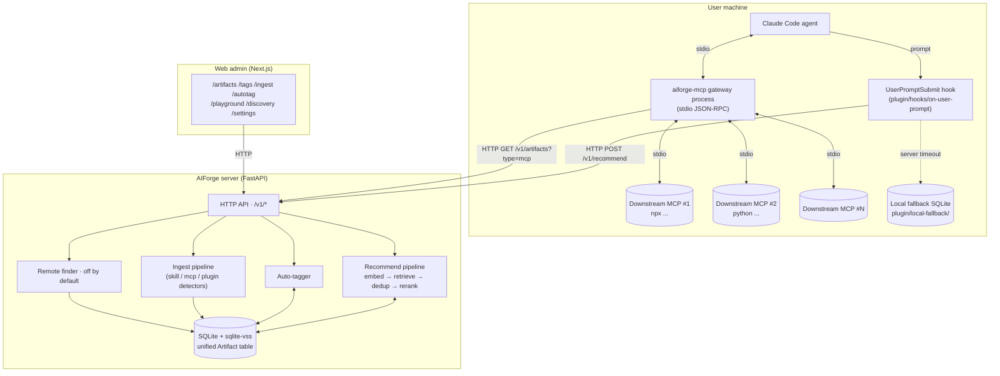

# AIForge architecture (v0.2 · unified artifact)

The shared contract for every AIForge component. Server, plugin, gateway, and the Web admin all reference this doc. Change behavior here first.

> 中文版本：[architecture.md](architecture.md)
> See also: [recommender-internals.en.md](recommender-internals.en.md) · [extension-spec.md](extension-spec.md) · [README.en.md](../README.en.md)

## 1. Goals & non-goals

Goals:

1. Top-N artifacts for a prompt in **< 300 ms p95** (warm server path).
2. One table backs **skill / MCP / plugin** behind a single `/v1/artifacts` surface.
3. Embedder < 100 MB RAM; optional rerank / autotag LLM < 2 GB.
4. Runs on a $5/month VPS. No API key required for the default config.
5. Plugin keeps working **without the server** (degraded mode).
6. The MCP gateway routes on the user's machine — downstream MCP code **never runs on the AIForge server**.
7. Adding a repo is **one HTTP call**; remote-discovered repos require manual approval.

Non-goals:

- Not a replacement for Claude Code / Codex / Cursor.
- Not a generic vector DB. One workflow: "prompt → top-N artifact".
- Not an MCP protocol implementation — the gateway is a transparent forwarder.

## 2. High-level topology



Notes:

- HTTP is always **hook / gateway / Web → server**, one-way. The server never reaches back into the user machine.
- The gateway runs **on the user machine**; downstream MCP subprocesses also run there. Permission and network boundary identical to a native MCP setup.
- If the server is unreachable, the hook switches to `local-fallback/index.sqlite` + keyword search.

## 3. Component inventory

### 3.1 Server `server/src/aiforge/`

| Subpackage | Files | Role |
|------------|-------|------|
| root | `main.py` / `config.py` | FastAPI app + lifespan; `Settings` (pydantic-settings, `AIFORGE_*` prefix) + `get_settings()` singleton |
| `api/` | `recommend` `skills` `tags` `ingest` `autotag` `admin` `health` | One router per file; `skills.py` hosts both `/v1/artifacts*` and the legacy `/v1/skills*` alias; `deps.py` provides DB-session and auth deps |
| `core/` | `models` `schemas` `db` `tags` | ORM, Pydantic, SQLite + sqlite-vss (`vss_search` with empty-index guard), tag helpers (`upsert_tag` / `add_artifact_tag` / `set_artifact_tags`) |
| `recommender/` | `embedder` `retriever` `deduper` `reranker` `tagger` `pipeline` | See [recommender-internals.en.md](recommender-internals.en.md) |
| `ingestion/` | `github` `parser` `detectors` `splitter` `mcp_adapter` `plugin_adapter` `pipeline` | shallow clone → detect → split → adapt → embed → upsert; `detectors.py` spots `.claude-plugin/plugin.json`, `mcp.json`, `package.json:mcpName`, … |
| `gateway/` | `registry` `proxy` `server` `cli` | `cli` = `aiforge-mcp` entry; `registry` pulls the active MCP set; `proxy` owns one downstream subprocess; `server` is the outward-facing stdio MCP |
| `discovery/` | `finder` `scorer` `approval` `scheduler` | Remote repo discovery (off by default) |

### 3.2 Plugin `plugin/`

| Path | Role |
|------|------|
| `.claude-plugin/plugin.json` | Claude Code plugin manifest |
| `hooks/on-user-prompt` | UserPromptSubmit hook → `lib/hook_entry.py` |
| `lib/client.py` | HTTP client (`list_artifacts` / `set_tags` / `trigger_autotag` …) |
| `lib/fallback.py` | Local SQLite + keyword search |
| `lib/injector.py` | Formats recommendations into the `<aiforge-recommendations>` block |
| `lib/install.py` | `install` / `uninstall` writes `~/.claude/settings.json` and `~/.claude/plugins/` |
| `lib/cli.py` | Subcommand dispatch |
| `commands/*.md` | `/aiforge:*` slash commands |
| `local-fallback/index.sqlite` | Cached snapshot of server's skills |
| `install.sh` | Registers hook + drops plugin |

### 3.3 Web admin `web/`

Next.js 14 (App Router) + Tailwind + custom shadcn-style components. 9 Chinese-first routes: `app/page.tsx` (Dashboard) / `app/artifacts/` / `app/tags/` / `app/ingest/` / `app/autotag/` / `app/playground/` / `app/discovery/` / `app/settings/`. `lib/api-client.ts` wraps the server REST; `lib/mock-data.ts` lets the UI keep demoing when the server is unreachable.

## 4. Data model

The `Skill` table is semantically the **Artifact** table. `artifact_type` distinguishes the three kinds. New code should use the `Artifact = Skill` alias.

```python
# core/models.py — single source of truth

ArtifactType = Literal["skill", "mcp", "plugin"]
TagSource = Literal["manual", "auto"]

class Skill(Base):                            # alias: Artifact = Skill
    id: str                                   # SHA256(source_url + source_path)[:16]
    name: str; description: str
    body: str                                 # skill=full md, mcp=blurb, plugin=README
    body_tokens: int
    source_url: str; source_path: str; source_repo: str
    source_stars: int; license: str | None
    embedding: bytes | None                   # packed float32; mirrors vss_skills
    cluster_id: int | None
    is_approved: bool; is_active: bool
    artifact_type: str                        # "skill"/"mcp"/"plugin"; default "skill"
    mcp_config: dict | None                   # see 4.1
    plugin_manifest: dict | None              # see 4.2
    created_at: datetime; updated_at: datetime
    last_recommended_at: datetime | None; recommend_count: int
    tags: list[ArtifactTag]                   # selectin

class Tag(Base):
    name: str                                 # PK; lowercase + hyphen
    description: str | None
    is_builtin: bool                          # 20 built-ins, undeletable via API
    created_at: datetime

class ArtifactTag(Base):                      # many-to-many
    skill_id: str                             # → skills.id
    tag_name: str                             # → tags.name
    source: TagSource                         # "manual" or "auto"
    score: float | None                       # autotag confidence ∈ [0, 1]
    created_at: datetime

class IngestJob(Base):
    id: str; source_url: str; branch: str; auto_approve: bool
    status: str                               # pending/fetching/parsing/embedding/done/error
    skills_added: int                         # combined count across all artifact types
    skills_updated: int; error: str | None
    created_at: datetime; finished_at: datetime | None

class PendingDiscovery(Base):
    id: str; source_url: str; source_repo: str
    source_stars: int; skill_count: int
    sample_skill_names: str                   # JSON list
    found_via: str                            # github-search / trending / user-suggest
    found_at: datetime; reviewed_at: datetime | None
    decision: str                             # pending/approved/rejected
    notes: str | None

class RecommendationLog(Base):
    id: str
    prompt_preview: str                       # first 500 chars
    agent: str | None; top_k: int; elapsed_ms: int
    candidates_considered: int; fallback_used: bool
    skill_ids: str                            # JSON array
    created_at: datetime                      # indexed
```

### 4.1 `mcp_config` shape

```json
{ "transport": "stdio",
  "command": "npx",
  "args": ["-y", "@modelcontextprotocol/server-filesystem", "/path"],
  "env": {"FOO": "bar"} }
```

```json
{ "transport": "http", "url": "https://api.example.com/mcp", "headers": {} }
```

```json
{ "transport": "sse", "url": "https://api.example.com/sse" }
```

> The current gateway only consumes `transport=stdio`. HTTP / SSE is reserved for v0.3.

### 4.2 `plugin_manifest` shape

```json
{ "name": "aiforge",
  "version": "0.1.0",
  "description": "...",
  "commands": ["commands/foo.md"],
  "hooks": {"UserPromptSubmit": "hooks/on-foo"},
  "skills": ["skills/x/SKILL.md"],
  "mcpServers": {},
  "manifest_path": ".claude-plugin/plugin.json",
  "install_url": "https://github.com/<owner>/<repo>" }
```

## 5. API contract

Everything is under `/v1`. Write endpoints require `Authorization: Bearer <key>` (or `x-api-key: <key>`) when `AIFORGE_API_KEY` is set.

| Method | Path | Purpose |
|--------|------|---------|
| `POST` | `/v1/recommend` | Main entry; returns top-N artifacts with score + rerank reason |
| `GET`  | `/v1/health` | `artifacts_count` / `reranker_available` / `embedder_loaded` / `uptime_seconds` |
| `GET`  | `/v1/artifacts` | Paged list; `?type=skill\|mcp\|plugin&tag=<name>&q=<text>&active=true` |
| `GET`  | `/v1/artifacts/{id}` | Detail incl. `mcp_config` / `plugin_manifest` |
| `GET`  | `/v1/skills` | Legacy alias for `/v1/artifacts` |
| `GET`  | `/v1/artifacts/{id}/tags` | Tags on this artifact (with source / score) |
| `PUT`  | `/v1/artifacts/{id}/tags` | Replace the whole tag set (≤ 20) |
| `POST` | `/v1/artifacts/{id}/tags` | Append one tag |
| `DELETE` | `/v1/artifacts/{id}/tags/{name}` | Remove one tag |
| `GET`  | `/v1/tags` | All tags + `artifact_count` |
| `POST` | `/v1/tags` | Create a custom tag |
| `DELETE` | `/v1/tags/{name}` | Delete; 400 if `is_builtin=True` |
| `POST` | `/v1/ingest` | Ingest a GitHub repo (async) |
| `GET`  | `/v1/ingest/{job_id}` | Ingest job status |
| `POST` | `/v1/admin/autotag` | Batch autotag (async); can target only-untagged |
| `GET`  | `/v1/admin/autotag/{job_id}` | Autotag job status |
| `GET`  | `/v1/admin/discoveries` | Remote-finder approval queue |
| `POST` | `/v1/admin/discoveries/{id}/approve` | Approve → triggers ingest |
| `POST` | `/v1/admin/discoveries/{id}/reject` | Reject |

### 5.1 `POST /v1/recommend`

```json
// Request
{ "prompt": "review this PR for security issues",
  "agent": "claude-code",
  "context": {"cwd": "/home/user/proj", "git_branch": "feat/auth"},
  "top_k": 3,
  "max_tokens": 4000,
  "exclude_ids": ["abc123..."],
  "types": null }
```

```json
// Response
{ "request_id": "req_01HZ...",
  "elapsed_ms": 142,
  "candidates_considered": 30,
  "fallback_used": false,
  "recommendations": [
    { "skill_id": "ab12cd34",
      "name": "security-review",
      "description": "Audit code against OWASP top 10",
      "body": "<full markdown>",
      "score": 0.91,
      "source_url": "https://github.com/owner/repo",
      "rerank_reason": "Directly addresses PR security review",
      "tokens": 850,
      "artifact_type": "skill",
      "tags": ["security", "code-review"],
      "mcp_config": null,
      "plugin_manifest": null }
  ] }
```

### 5.2 `POST /v1/ingest`

```json
// Request
{ "github_url": "https://github.com/obra/superpowers-skills",
  "branch": "main",
  "auto_approve": true }

// Response
{ "job_id": "job_01HZ...", "status": "pending" }
```

Ingest detects skill / mcp / plugin in parallel — one repo may yield multiple artifacts.

### 5.3 `POST /v1/admin/autotag`

```json
// Request
{ "artifact_ids": null,                  // null = all
  "only_untagged": true,
  "max_tags_per_artifact": 3,
  "background": true }

// Response
{ "job_id": "auto_01HZ...",
  "status": "running",
  "artifacts_total": 312,
  "artifacts_tagged": 0,
  "error": null }
```

## 6. Plugin behavior

### 6.1 Hook injection

Each user prompt:

1. `hooks/on-user-prompt` reads the prompt from stdin
2. `POST /v1/recommend` with a 250 ms timeout
3. On success → `injector.py` builds an `<aiforge-recommendations>` XML block on stdout
4. On failure → `lib/fallback.py`; warn once per session
5. Fallback empty → no-op + a one-line tip

### 6.2 install / uninstall

`plugin/lib/install.py` chooses the write path by artifact type:

| Type | install | uninstall |
|------|---------|-----------|
| `mcp` | Write `mcp_config` under `mcpServers.<name>` in `~/.claude/settings.json`; backup first to `settings.json.bak.<ts>` | Delete that key |
| `plugin` | `git clone <install_url>` to `~/.claude/plugins/<name>/` | Remove that directory |
| `skill` | Not supported (used via recommendation injection); friendly error | Same |

`/aiforge:list --installed` cross-references these two locations against the server list.

## 7. MCP runtime gateway

### 7.1 Startup flow

```
aiforge-mcp                                # pyproject [project.scripts] entry
  └─ gateway/cli.py:main()
       1. parse --aiforge-url / --tags / --pin (or AIFORGE_GATEWAY_* env)
       2. registry.Registry.load() →
            GET /v1/artifacts?type=mcp&active=true&limit=500
            tag filter (OR semantics) + union with pin_ids
            GET /v1/artifacts/{id} for each → grab mcp_config
       3. GatewayServer(active).start_proxies()
            spawn MCPProxy subprocess per ActiveMCP
            handshake + cache tools/list
       4. serve_stdio() — main event loop
```

### 7.2 Namespace routing

Downstream tools are exposed with a namespace prefix:

```
<artifact_name>__<tool_name>       # e.g. playwright-mcp__browser_click
```

On `tools/call`, the gateway splits on the **first** `__` (tools whose names contain `__` still work). Unknown prefix or dead proxy → JSON-RPC result with `isError=true`, so the agent can degrade gracefully.

### 7.3 Failure isolation

- A proxy that fails to `start` does **not** crash the gateway — it just doesn't appear in `tools/list`
- A failing `tools/call` returns `isError` for that one tool only
- stdout is **JSON-RPC only**; all logs go to stderr (structlog default) — otherwise the wire protocol breaks

### 7.4 Current limits (MVP)

- Only `transport=stdio` downstreams are supported
- The active set is loaded **once at startup**; no hot reload (v0.3 plans `POST /v1/gateway/reload`)
- No prompts / resources / sampling capabilities
- Tool-name collisions keep the **first** registration and emit a warning

## 8. Failure modes & fallbacks

| Failure | Behavior |
|---------|----------|
| Server unreachable | Hook → local SQLite + keyword search; warn once per session |
| Local index empty + server unreachable | Hook becomes a no-op; one-line tip to run `/aiforge:sync` |
| Reranker backend unavailable | Skip rerank, sort by embedding score, response carries `fallback_used: true` |
| Embedder OOM | Server returns 503; plugin switches to fallback |
| Ingest of private repo | `AIFORGE_GITHUB_TOKEN`; 401 otherwise |
| Artifact body over budget | Truncate tail + append `[...truncated, see /v1/artifacts/{id}]` |
| Autotag LLM backend unavailable / timeout | Skip that artifact silently; job continues; no auto tag is written |
| Gateway downstream fails to start | Skip that proxy; the rest are still exposed |
| Gateway `tools/call` fails | Return `isError=true` to the agent |

## 9. Security model

- The server **binds `127.0.0.1`** by default. Put it behind a reverse proxy in prod.
- `AIFORGE_API_KEY` gates all writes via bearer / `x-api-key`.
- The Web admin uses the same API key for writes — `/settings` stores it in the browser locally.
- Ingest runs in a sandboxed temp dir; repo code is **never executed**, only `SKILL.md` / `*.json` are read.
- Remote finder requires `AIFORGE_ENABLE_REMOTE_FINDER=true` and mandatory manual approval.
- The plugin **never sends user source code**, only the prompt text.
- **Downstream MCP subprocesses spawn on the user's machine**, not on the AIForge server — the security boundary matches a native MCP setup exactly.

## 10. Performance targets

| Operation | Target | Conditions |
|-----------|--------|------------|
| `/v1/recommend` p50 | < 150 ms | warm, 5K artifacts, MiniLM + Qwen-1.5B |
| `/v1/recommend` p95 | < 300 ms | same |
| `/v1/recommend` no rerank | < 80 ms | `fallback_used=true` |
| Ingest 100 artifacts | < 30 s | shallow clone + embed batch |
| Local fallback recommend | < 50 ms | keyword search over 5K rows |
| Autotag one artifact | < 3 s | Qwen-1.5B CPU; timeout → skip |
| Autotag 100 artifacts | < 5 min | serial + 50 ms throttle |
| Cold start (server) | < 8 s | model load |
| Gateway `tools/list` p95 | < 50 ms cold, < 5 ms warm | cache-hit |

## 11. Configuration

All `AIFORGE_*`. See [`server/.env.example`](../server/.env.example).

| Var | Default | Purpose |
|-----|---------|---------|
| `AIFORGE_HOST` | `127.0.0.1` | Server bind host |
| `AIFORGE_PORT` | `8765` | Server bind port |
| `AIFORGE_DB_PATH` | `./data/aiforge.db` | SQLite path (parent dir auto-created) |
| `AIFORGE_EMBEDDER_MODEL` | `sentence-transformers/all-MiniLM-L6-v2` | HuggingFace model id |
| `AIFORGE_EMBEDDER_DIM` | `384` | Must match embedder output dim |
| `AIFORGE_RERANKER` | `ollama` | `ollama` / `haiku` / `none` |
| `AIFORGE_RERANKER_MODEL` | `qwen2.5:1.5b` | Ollama tag |
| `AIFORGE_OLLAMA_HOST` | `http://localhost:11434` | Ollama address |
| `AIFORGE_ANTHROPIC_API_KEY` | — | Required when reranker=haiku or tagger=haiku |
| `AIFORGE_TOP_K_DEFAULT` | `3` | Default rec count |
| `AIFORGE_RETRIEVE_K` | `30` | First-stage candidate count |
| `AIFORGE_MAX_TOKENS_DEFAULT` | `4000` | Default body token budget |
| `AIFORGE_API_KEY` | — | Optional bearer auth |
| `AIFORGE_GITHUB_TOKEN` | — | Ingest private repos / higher rate limit |
| `AIFORGE_ENABLE_REMOTE_FINDER` | `false` | Discovery on/off |
| `AIFORGE_FINDER_INTERVAL_SECONDS` | `86400` | Discovery poll interval |
| `AIFORGE_LOG_LEVEL` | `INFO` | `DEBUG` / `INFO` / `WARNING` / `ERROR` |
| `AIFORGE_LOG_FORMAT` | `json` | `json` / `console` |
| `AIFORGE_SERVER_URL` | `http://localhost:8765` | Gateway → server URL |
| `AIFORGE_GATEWAY_ACTIVE_TAGS` | — | CSV; gateway filters active MCPs by tag |
| `AIFORGE_GATEWAY_PIN_IDS` | — | CSV; artifact ids forced into the gateway set, bypassing tag filter |
