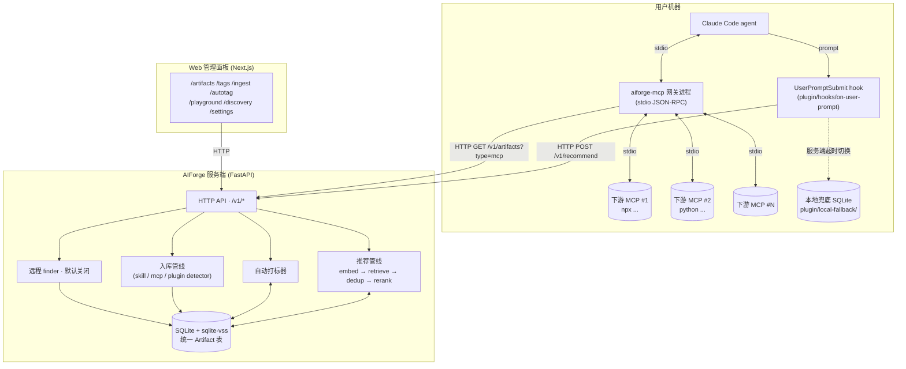

# AIForge 架构（v0.2 · 统一 Artifact）

AIForge 所有组件的**共享契约**。Server、plugin、gateway、Web 面板都引用本文档。改行为之前先改这里。

> English version: [architecture.en.md](architecture.en.md)
> 配套阅读：[recommender-internals.md](recommender-internals.md) · [extension-spec.md](extension-spec.md) · [README.md](../README.md)

## 1. 设计目标 & 非目标

目标：

1. 给定 user prompt，**< 300 ms p95**（server 热路径）返回 top-N artifact
2. 一张表同时承载 **skill / MCP / plugin**，对外是同一组 `/v1/artifacts` API
3. 向量编码 < 100 MB 内存，可选小 LLM 重排 / 自动打标 < 2 GB
4. $5 / 月的 VPS 上跑得动；默认零 API 费用
5. 插件**没有服务端也能工作**（本地兜底）
6. MCP 网关在用户机器本地路由，**永远不在服务端执行下游 MCP 代码**
7. 添加新仓库 = **一次 HTTP 调用**；远程发现的条目**必须人工审批**

非目标：

- 不替代 Claude Code / Codex / Cursor 本身
- 不做通用向量数据库 —— 只服务"prompt → top-N artifact"这一个工作流
- 不做 MCP 协议本身的实现 —— gateway 只是**透明转发**到下游

## 2. 高层拓扑



注意：

- **HTTP 永远是 hook / gateway / Web → server 的单向调用**；server 不主动连用户机器
- gateway 进程在用户机器本地启动，**下游 MCP 子进程也在用户本地**，权限/网络隔离与本地原生 MCP 一致
- 服务端不可达 → hook 走 `local-fallback/index.sqlite` + 关键词检索

## 3. 组件清单

### 3.1 服务端 `server/src/aiforge/`

| 子包 | 文件 | 职责 |
|------|------|------|
| 根 | `main.py` / `config.py` | FastAPI 应用 + lifespan；`Settings`（pydantic-settings，`AIFORGE_*` 前缀）+ `get_settings()` 单例 |
| `api/` | `recommend` `skills` `tags` `ingest` `autotag` `admin` `health` | 一文件一组路由；`skills.py` 同时托管 `/v1/artifacts*` 和旧的 `/v1/skills*` 别名；`deps.py` 提供 DB session 和 auth 依赖 |
| `core/` | `models` `schemas` `db` `tags` | ORM、Pydantic、SQLite + sqlite-vss（`vss_search` 含空索引保护）、tag 业务函数（`upsert_tag` / `add_artifact_tag` / `set_artifact_tags`） |
| `recommender/` | `embedder` `retriever` `deduper` `reranker` `tagger` `pipeline` | 见 [recommender-internals.md](recommender-internals.md) |
| `ingestion/` | `github` `parser` `detectors` `splitter` `mcp_adapter` `plugin_adapter` `pipeline` | shallow clone → detect → split → adapt → embed → upsert；`detectors.py` 识别 `.claude-plugin/plugin.json`、`mcp.json`、`package.json:mcpName` 等 |
| `gateway/` | `registry` `proxy` `server` `cli` | `cli` = `aiforge-mcp` 命令入口；`registry` 拉 active MCP；`proxy` 管单个下游子进程；`server` 实现对外 stdio MCP |
| `discovery/` | `finder` `scorer` `approval` `scheduler` | 远程仓库发现（默认关闭） |

### 3.2 插件 `plugin/`

| 路径 | 职责 |
|------|------|
| `.claude-plugin/plugin.json` | Claude Code 插件 manifest |
| `hooks/on-user-prompt` | UserPromptSubmit hook，调 `lib/hook_entry.py` |
| `lib/client.py` | server HTTP 客户端（`list_artifacts` / `set_tags` / `trigger_autotag` 等） |
| `lib/fallback.py` | 本地 SQLite + 关键词检索 |
| `lib/injector.py` | 把推荐结果格式化成 `<aiforge-recommendations>` 上下文块 |
| `lib/install.py` | `install` / `uninstall` 写 `~/.claude/settings.json` 和 `~/.claude/plugins/` |
| `lib/cli.py` | 子命令 dispatch |
| `commands/*.md` | `/aiforge:*` slash 命令定义 |
| `local-fallback/index.sqlite` | server skills 的本地缓存快照 |
| `install.sh` | 注册 hook + 落 plugin |

### 3.3 Web 管理面板 `web/`

Next.js 14（App Router） + Tailwind + 自研 shadcn 风格组件。9 条中文路由：`app/page.tsx`（Dashboard）/ `app/artifacts/` / `app/tags/` / `app/ingest/` / `app/autotag/` / `app/playground/` / `app/discovery/` / `app/settings/`。`lib/api-client.ts` 封装 server REST；`lib/mock-data.ts` 让 server 不可达时 UI 仍可演示。

## 4. 数据模型

`Skill` 表语义上是 **Artifact**，通过 `artifact_type` 区分三类。新代码用 `Artifact = Skill` 别名。

```python
# core/models.py — 单一真相源

ArtifactType = Literal["skill", "mcp", "plugin"]
TagSource = Literal["manual", "auto"]

class Skill(Base):                            # 别名：Artifact = Skill
    id: str                                   # SHA256(source_url + source_path)[:16]
    name: str                                 # frontmatter 或 manifest 名
    description: str
    body: str                                 # skill=full md, mcp=blurb, plugin=README
    body_tokens: int
    source_url: str; source_path: str; source_repo: str
    source_stars: int; license: str | None
    embedding: bytes | None                   # 打包 float32；与 vss_skills 同步
    cluster_id: int | None
    is_approved: bool; is_active: bool
    artifact_type: str                        # "skill"/"mcp"/"plugin"，默认 "skill"
    mcp_config: dict | None                   # 见 4.1
    plugin_manifest: dict | None              # 见 4.2
    created_at: datetime; updated_at: datetime
    last_recommended_at: datetime | None; recommend_count: int
    tags: list[ArtifactTag]                   # selectin

class Tag(Base):
    name: str                                 # 主键；小写 + 中划线
    description: str | None
    is_builtin: bool                          # 预置 20 个不允许 API 删除
    created_at: datetime

class ArtifactTag(Base):                      # 多对多关联
    skill_id: str                             # → skills.id
    tag_name: str                             # → tags.name
    source: TagSource                         # "manual" 或 "auto"
    score: float | None                       # auto 置信度 ∈ [0, 1]
    created_at: datetime

class IngestJob(Base):
    id: str; source_url: str; branch: str; auto_approve: bool
    status: str                               # pending/fetching/parsing/embedding/done/error
    skills_added: int                         # 合并计数（含所有 artifact 类型）
    skills_updated: int; error: str | None
    created_at: datetime; finished_at: datetime | None

class PendingDiscovery(Base):
    id: str; source_url: str; source_repo: str
    source_stars: int; skill_count: int
    sample_skill_names: str                   # JSON list
    found_via: str                            # github-search / trending / user-suggest
    found_at: datetime; reviewed_at: datetime | None
    decision: str                             # pending/approved/rejected
    notes: str | None

class RecommendationLog(Base):
    id: str
    prompt_preview: str                       # 前 500 字符
    agent: str | None; top_k: int; elapsed_ms: int
    candidates_considered: int; fallback_used: bool
    skill_ids: str                            # JSON 数组
    created_at: datetime                      # 带索引
```

### 4.1 `mcp_config` 形状

```json
{ "transport": "stdio",
  "command": "npx",
  "args": ["-y", "@modelcontextprotocol/server-filesystem", "/path"],
  "env": {"FOO": "bar"} }
```

```json
{ "transport": "http", "url": "https://api.example.com/mcp", "headers": {} }
```

```json
{ "transport": "sse", "url": "https://api.example.com/sse" }
```

> 当前 gateway 仅消费 `transport=stdio`。HTTP / SSE 路径预留给 v0.3。

### 4.2 `plugin_manifest` 形状

```json
{ "name": "aiforge",
  "version": "0.1.0",
  "description": "...",
  "commands": ["commands/foo.md"],
  "hooks": {"UserPromptSubmit": "hooks/on-foo"},
  "skills": ["skills/x/SKILL.md"],
  "mcpServers": {},
  "manifest_path": ".claude-plugin/plugin.json",
  "install_url": "https://github.com/<owner>/<repo>" }
```

## 5. API 契约

所有端点都在 `/v1` 前缀下。带"写"的端点在 `AIFORGE_API_KEY` 设置时需要 `Authorization: Bearer <key>`（或 `x-api-key: <key>`）。

| 方法 | 路径 | 说明 |
|------|------|------|
| `POST` | `/v1/recommend` | 主入口；返回 top-N artifact + score + rerank reason |
| `GET`  | `/v1/health` | 服务状态：`artifacts_count` / `reranker_available` / `embedder_loaded` / `uptime_seconds` |
| `GET`  | `/v1/artifacts` | 分页列表，支持 `?type=skill\|mcp\|plugin&tag=<name>&q=<text>&active=true` |
| `GET`  | `/v1/artifacts/{id}` | 详情，含 `mcp_config` / `plugin_manifest` |
| `GET`  | `/v1/skills` | `/v1/artifacts` 的旧别名，参数相同 |
| `GET`  | `/v1/artifacts/{id}/tags` | 该 artifact 的 tag 列表（含 source / score） |
| `PUT`  | `/v1/artifacts/{id}/tags` | 整体替换 tag 集合（≤ 20 个） |
| `POST` | `/v1/artifacts/{id}/tags` | 追加单个 tag |
| `DELETE` | `/v1/artifacts/{id}/tags/{name}` | 移除单个 tag |
| `GET`  | `/v1/tags` | 全部 tag + `artifact_count` |
| `POST` | `/v1/tags` | 新建自定义 tag |
| `DELETE` | `/v1/tags/{name}` | 删除 tag；`is_builtin=True` 时返回 400 |
| `POST` | `/v1/ingest` | 入库 GitHub 仓库（异步） |
| `GET`  | `/v1/ingest/{job_id}` | ingest 任务状态 |
| `POST` | `/v1/admin/autotag` | 批量自动打标（异步），可只跑未打 auto tag 的 |
| `GET`  | `/v1/admin/autotag/{job_id}` | 打标任务状态 |
| `GET`  | `/v1/admin/discoveries` | 远程 finder 待审批列表 |
| `POST` | `/v1/admin/discoveries/{id}/approve` | 批准 → 触发 ingest |
| `POST` | `/v1/admin/discoveries/{id}/reject` | 拒绝 |

### 5.1 `POST /v1/recommend`

```json
// 请求
{ "prompt": "审查 PR 看安全问题",
  "agent": "claude-code",
  "context": {"cwd": "/home/user/proj", "git_branch": "feat/auth"},
  "top_k": 3,
  "max_tokens": 4000,
  "exclude_ids": ["abc123..."],
  "types": null }
```

```json
// 响应
{ "request_id": "req_01HZ...",
  "elapsed_ms": 142,
  "candidates_considered": 30,
  "fallback_used": false,
  "recommendations": [
    { "skill_id": "ab12cd34",
      "name": "security-review",
      "description": "审查代码中的 OWASP top 10",
      "body": "<完整 markdown>",
      "score": 0.91,
      "source_url": "https://github.com/owner/repo",
      "rerank_reason": "直接对应 PR 安全审查",
      "tokens": 850,
      "artifact_type": "skill",
      "tags": ["security", "code-review"],
      "mcp_config": null,
      "plugin_manifest": null }
  ] }
```

### 5.2 `POST /v1/ingest`

```json
// 请求
{ "github_url": "https://github.com/obra/superpowers-skills",
  "branch": "main",
  "auto_approve": true }

// 响应
{ "job_id": "job_01HZ...", "status": "pending" }
```

入库会同时探测 skill / mcp / plugin —— 一个仓库可能产出多种 artifact。

### 5.3 `POST /v1/admin/autotag`

```json
// 请求
{ "artifact_ids": null,                  // null = 全库
  "only_untagged": true,
  "max_tags_per_artifact": 3,
  "background": true }

// 响应
{ "job_id": "auto_01HZ...",
  "status": "running",
  "artifacts_total": 312,
  "artifacts_tagged": 0,
  "error": null }
```

## 6. 插件行为

### 6.1 hook 注入

每一轮 user prompt：

1. `hooks/on-user-prompt` 从 stdin 读 prompt
2. `POST /v1/recommend`，超时 250 ms
3. 成功 → `injector.py` 把推荐塞进 `<aiforge-recommendations>` XML 块，stdout 输出给 Claude Code
4. 失败 → 切 `lib/fallback.py`，每个 session 仅警告一次
5. 兜底也空 → 一行提示后 no-op

### 6.2 install / uninstall

`plugin/lib/install.py` 根据 artifact 类型写不同地方：

| 类型 | install | uninstall |
|------|---------|-----------|
| `mcp` | `~/.claude/settings.json` 的 `mcpServers.<name>` 写 `mcp_config`；先 backup 到 `settings.json.bak.<ts>` | 删除该 key |
| `plugin` | `git clone <install_url>` 到 `~/.claude/plugins/<name>/` | 删除该目录 |
| `skill` | 当前不支持本地 install（直接通过推荐使用）；返回友好错误 | 同上 |

`/aiforge:list --installed` 会扫描这两处与服务端列表交叉。

## 7. MCP 运行时网关

### 7.1 启动流程

```
aiforge-mcp                                # pyproject [project.scripts] 入口
  └─ gateway/cli.py:main()
       1. 解析 --aiforge-url / --tags / --pin 等参数（或读 AIFORGE_GATEWAY_* env）
       2. registry.Registry.load() →
            GET /v1/artifacts?type=mcp&active=true&limit=500
            tags 过滤（OR 语义）+ 并入 pin_ids
            对每个 id GET /v1/artifacts/{id} 拿 mcp_config
       3. GatewayServer(active).start_proxies()
            为每个 ActiveMCP 起一个 MCPProxy 子进程
            handshake + tools/list 缓存
       4. serve_stdio() —— 主事件循环
```

### 7.2 命名空间路由

下游 tool 名加前缀暴露：

```
<artifact_name>__<tool_name>     # 例：playwright-mcp__browser_click
```

收到 `tools/call` 时按 **第一个** `__` 拆分（兼容名字本身含双下划线的 tool）。前缀解析失败或目标 proxy 已死 → 返回 `isError=true` 的 result，让 agent 优雅降级。

### 7.3 失败隔离

- 某个 proxy `start` 失败 → 整个 gateway **不**崩溃，只是该 proxy 不进 `tools/list`
- 某个 `tools/call` 失败 → 单独返回 isError，不影响别的工具
- stdout **只写 JSON-RPC**，所有日志走 stderr（structlog 默认）—— 否则会污染对外协议

### 7.4 当前限制（MVP）

- 只支持 `transport=stdio` 的下游
- active 集合**启动时一次性加载**，无热更（v0.3 计划加 `POST /v1/gateway/reload`）
- 不实现 prompts / resources / sampling 高级 capability
- tool name 冲突时**保留先注册的**并打 warning

## 8. 失败模式与兜底

| 故障 | 行为 |
|------|------|
| 服务端不可达 | hook 切本地 SQLite + 关键词检索；每 session 仅警告一次 |
| 本地索引为空 + 服务端不可达 | hook 变 no-op，打印一行提示，建议运行 `/aiforge:sync` |
| Reranker 模型不可用 | 跳过 rerank，按 embedding score 排序，响应里 `fallback_used: true` |
| Embedder OOM | server 返回 503；插件切兜底 |
| Ingest 私有仓库 | 用 `AIFORGE_GITHUB_TOKEN`；缺则返回 401 |
| artifact body 超 token 预算 | 截断尾部 + 加 `[…截断，详见 /v1/artifacts/{id}]` 标记 |
| 自动打标 LLM 后端不可用 / 超时 | 单条**静默跳过**，job 继续，受影响 artifact 不写入任何 auto tag |
| gateway 某个下游启动失败 | 跳过该 proxy，其余工具正常暴露 |
| gateway 某个 `tools/call` 失败 | 返回 `isError=true` 的 result，agent 自行降级 |

## 9. 安全模型

- 服务端**默认绑定 `127.0.0.1`**，生产部署在反向代理后
- `AIFORGE_API_KEY` 设置后所有写操作需要 bearer / `x-api-key`
- Web 面板的写操作走同一套 API key —— `/settings` 路由让用户在浏览器本地存
- Ingest 在沙箱 temp 目录执行；**永远不执行**仓库代码，只读 `SKILL.md` / `*.json`
- 远程 finder 需显式 `AIFORGE_ENABLE_REMOTE_FINDER=true`，且强制人工审批
- 插件**不发送用户源码**，只发送 prompt 文本
- **gateway 下游 MCP 在用户机器本地起子进程**，不在 AIForge server 上跑 —— 权限边界与原生 MCP 完全一致

## 10. 性能目标

| 操作 | 目标 | 测量条件 |
|------|------|----------|
| `/v1/recommend` p50 | < 150 ms | 热启动、5K artifact、MiniLM + Qwen-1.5B |
| `/v1/recommend` p95 | < 300 ms | 同上 |
| `/v1/recommend` 无 rerank | < 80 ms | `fallback_used=true` |
| 批量入库 100 个 artifact | < 30 s | shallow clone + 批量 embed |
| 本地兜底推荐 | < 50 ms | 5K 行关键词检索 |
| 自动打标单条 | < 3 s | Qwen-1.5B CPU；超时即跳过 |
| 自动打标 100 条 | < 5 min | 串行 + 50 ms 节流 |
| 冷启动（server） | < 8 s | 模型加载 |
| gateway `tools/list` p95 | < 50 ms 冷、< 5 ms 热 | 缓存命中 |

## 11. 配置变量

全部 `AIFORGE_*` 前缀。see [`server/.env.example`](../server/.env.example)。

| 变量 | 默认 | 用途 |
|------|------|------|
| `AIFORGE_HOST` | `127.0.0.1` | server 绑定地址 |
| `AIFORGE_PORT` | `8765` | server 绑定端口 |
| `AIFORGE_DB_PATH` | `./data/aiforge.db` | SQLite 路径（父目录自动创建） |
| `AIFORGE_EMBEDDER_MODEL` | `sentence-transformers/all-MiniLM-L6-v2` | HuggingFace 模型 ID |
| `AIFORGE_EMBEDDER_DIM` | `384` | 必须与 embedder 输出维度一致 |
| `AIFORGE_RERANKER` | `ollama` | `ollama` / `haiku` / `none` |
| `AIFORGE_RERANKER_MODEL` | `qwen2.5:1.5b` | ollama 模型 tag |
| `AIFORGE_OLLAMA_HOST` | `http://localhost:11434` | ollama 服务地址 |
| `AIFORGE_ANTHROPIC_API_KEY` | — | reranker=haiku 或 tagger=haiku 时必填 |
| `AIFORGE_TOP_K_DEFAULT` | `3` | 默认推荐数 |
| `AIFORGE_RETRIEVE_K` | `30` | 第一阶段候选数 |
| `AIFORGE_MAX_TOKENS_DEFAULT` | `4000` | 默认 body token 预算 |
| `AIFORGE_API_KEY` | — | 可选 bearer 鉴权 |
| `AIFORGE_GITHUB_TOKEN` | — | ingest 私有仓库 / 提高 rate limit |
| `AIFORGE_ENABLE_REMOTE_FINDER` | `false` | 远程发现总开关 |
| `AIFORGE_FINDER_INTERVAL_SECONDS` | `86400` | 远程发现轮询周期 |
| `AIFORGE_LOG_LEVEL` | `INFO` | `DEBUG` / `INFO` / `WARNING` / `ERROR` |
| `AIFORGE_LOG_FORMAT` | `json` | `json` / `console` |
| `AIFORGE_SERVER_URL` | `http://localhost:8765` | gateway 找 server 的地址 |
| `AIFORGE_GATEWAY_ACTIVE_TAGS` | — | CSV，gateway 启动时过滤 active MCP 的 tag |
| `AIFORGE_GATEWAY_PIN_IDS` | — | CSV，gateway 强制加入的 artifact id，绕过 tag 过滤 |
| `AIFORGE_LOG_LEVEL`（gateway 进程） | `INFO` | gateway CLI 同名变量 |
