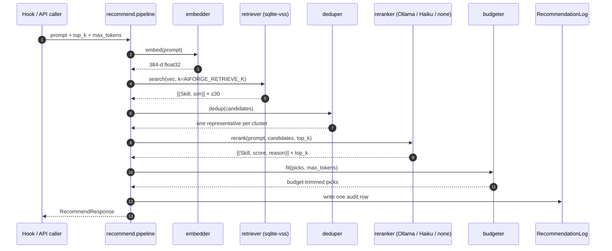

# Recommender internals (v0.2)

> 中文: [recommender-internals.md](recommender-internals.md)
> See also: [architecture.en.md](architecture.en.md) · [extension-spec.md](extension-spec.md) · [README.en.md](../README.en.md)

After this doc you should be able to:

- Explain why AIForge isn't a single-stage vector search
- Run the eval harness in `server/tests/eval/` and compare prompt changes
- Swap a reranker / tagger prompt, swap embedders, or add a backend without breaking the pipeline
- Understand why the autotagger shares a backend with the reranker but lives in its own module

This doc covers **only the recommend pipeline + autotagger**. The artifact registry, tag CRUD, and gateway live in [architecture.en.md](architecture.en.md).

## 1. Pipeline overview



Each stage is an isolated module with its own tests and can be swapped. The **autotagger** reuses the same LLM backend pool but runs as an ingest-time background job, **not** on the recommend hot path.

## 2. Embedder

File: `server/src/aiforge/recommender/embedder.py`

| Field | Value |
|-------|-------|
| Default model | `sentence-transformers/all-MiniLM-L6-v2` |
| Dim | 384 |
| Model size | ~90 MB |
| Single encode | ~3 ms (CPU) |
| Loading | In-process singleton (`get_embedder()`), first-call sync load + a warmup encode |
| Device | `device="cpu"` is explicit to avoid surprise CUDA probes on GPU-less VPSes |
| Output | L2-normalized `np.float32` (force-cast — some versions return float64, which sqlite-vss won't accept) |

Why MiniLM-L6:

- 384-dim hits the size/quality sweet spot on [MTEB retrieval](https://huggingface.co/spaces/mteb/leaderboard)
- Half the size of L12 (768-dim), only 2–3 points worse
- CPU-runnable → $5/month-VPS-runnable

When to swap:

- Heavy multilingual workload → `paraphrase-multilingual-MiniLM-L12-v2`
- Library < 1000 artifacts + quality matters → `BAAI/bge-small-en-v1.5`
- Library > 100k → quantize + real ANN (HNSW)

> Swapping the embedder **requires reindexing**. Embeddings live in two places: `Skill.embedding` (packed bytes) and the `vss_skills` virtual table; they must stay in sync.

## 3. Retriever

File: `server/src/aiforge/recommender/retriever.py`

Implementation: sqlite-vss `vss_search` with cosine distance.

```sql
SELECT rowid, distance
FROM vss_skills
WHERE vss_search(embedding, vss_search_params(:emb, :k));
```

Two gotchas:

1. **Must use `vss_search_params(emb, k)`** — otherwise the underlying FAISS asserts "k > 0" and SIGABRTs (sqlite-vss 0.1.x quirk).
2. **Empty-index guard**: FAISS also SIGABRTs on a 0-vector index, so `core/db.py:vss_search()` first runs `SELECT count(*) FROM vss_skills` and returns `[]` if zero.

After raw search, `retrieve()`:

- Over-fetches `top_k + len(exclude) + 10` to leave headroom for `exclude_ids` / inactive rows
- Bridges rowid → skill_id with raw SQL (the ORM doesn't expose rowid)
- Filters to `is_active=True AND is_approved=True`
- Maps cosine distance → similarity ∈ [0, 1]

`AIFORGE_RETRIEVE_K=30` is the default. Empirically:

| `retrieve_k` | Recall (gold top-3 inside top-K) | Added rerank latency |
|--------------|-----------------------------------|----------------------|
| 10 | < 80% — misses the right answer too often | baseline |
| 30 | > 90% — the default | +0 |
| 50 | > 95% | +300 ms |

## 4. Deduper

File: `server/src/aiforge/recommender/deduper.py`

Why: user libraries collect multiple artifacts doing the same thing — three review skills, four test runners, two Playwright MCPs. If the reranker sees 6 equivalent candidates they collectively fill the top-3 and waste context.

Algorithm:

1. `AgglomerativeClustering(metric="cosine", distance_threshold=0.15)` on the ≤30 candidates (≈ cosine_similarity > 0.85 considered the same cluster).
2. Score each candidate per cluster, pick the highest:

```
score = 0.5 * sim_to_query
      + 0.3 * log(stars + 1) / log(100_000)   # capped to [0, 1], 100k stars saturates
      + 0.2 * exp(-ln(2) * age_days / 180)    # 180-day half-life
```

3. Write `cluster_id` back to chosen skills; preserve input order (already similarity-desc).

Output: ≤ 30 deduplicated candidates, one per cluster.

Tuning guide:

| Symptom | Knob |
|---------|------|
| "Obvious duplicates not deduped" | `_CLUSTER_DISTANCE_THRESHOLD` 0.15 → 0.20 |
| "Different things got merged" | 0.15 → 0.10 |
| Library > 50k | Switch to HDBSCAN (heavier startup, better noise handling) |
| Older repos suppressed | Lower recency weight (default 0.2) |
| Niche quality repos suppressed | Lower stars weight (default 0.3) |

## 5. Reranker

File: `server/src/aiforge/recommender/reranker.py`

Backend chosen by `AIFORGE_RERANKER`:

| Backend | Notes | Latency | Quality |
|---------|-------|---------|---------|
| `ollama` | Default, local Qwen2.5-1.5B | ~500 ms (CPU) | Good |
| `haiku` | Anthropic API, Claude Haiku | ~400 ms (network) | Best |
| `none` | Skip, sort by embedding similarity | < 5 ms | OK |

Any backend failure (HTTP, JSON parse, timeout) **silently falls back to embedding-only ordering** with `fallback_used: true` on the response. Never raised upstream.

Actual prompt:

```
SYSTEM:
你是一个 skill 路由器的排序助手。用户向 AI 编程 agent 提了一个问题，
你需要从候选 skill 列表里挑出最有帮助的几条。请严格输出 JSON，
不要任何 Markdown 代码块包裹，不要解释。

USER:
用户的问题：
"""
{prompt}    # truncated to first 2000 chars
"""

候选 skill（共 {n} 条，按相似度初排）：
[1] name=<name> | sim=0.87 | desc=<first 160 chars>
[2] name=<name> | sim=0.83 | desc=<first 160 chars>
...

请为每条候选打 0-100 分（100 = 极度相关，0 = 完全无关），并给一句不超过
30 字的中文理由。按相关度从高到低排序，只返回前 {top_k} 条。

返回这个 JSON 结构：
{
  "ranking": [
    {"index": <候选编号，从 1 开始>, "score": <0-100 整数>, "reason": "<中文理由>"}
  ]
}
```

The prompt is Chinese on purpose — Qwen-1.5B follows Chinese instructions more reliably than English at this size. Full source: `reranker.py:_SYSTEM_PROMPT` / `_USER_PROMPT_TEMPLATE`.

JSON parsing is **lenient** (small models love leading/trailing fluff):

1. Try `json.loads(raw.strip())`
2. On failure, regex `\{.*\}` for the first JSON object and retry
3. Still failing → treat as a backend failure → trigger fallback

Eval:

```bash
cd server
uv run pytest tests/eval/ -v
# 100+ annotated prompts as regression
```

Tracked metrics:

- **top-1 hit rate** — gold artifact in top-1
- **top-3 hit rate** — gold artifact in top-3
- **nDCG@3** — overall ranking quality

## 6. Auto-tagger (new in v0.2)

File: `server/src/aiforge/recommender/tagger.py`

**Core constraint**: the tagger reuses reranker backend *settings* (`reranker` / `reranker_model` / `ollama_host` / `anthropic_api_key`) but the **code is independent**. The `_call_ollama` / `_call_haiku` helpers are **copied** from the reranker — no private-function imports, so signatures can drift without breaking one or the other.

### 6.1 Trigger path

- `POST /v1/admin/autotag` → `api/autotag.py:_run_job` (background thread)
- Artifact selection: `only_untagged=True` by default — skip rows that already have any `source='auto'` tag
- Serial processing with a 50 ms sleep between calls (don't blow up Ollama); per-call timeout 3 s
- Candidate tag set = `BUILTIN_TAGS` dict (the 20 built-ins). The LLM may only return keys from this set.
- Hits get written via `core/tags.add_artifact_tag(source="auto", score=…)`, which upserts a missing tag row on demand.

### 6.2 Prompt (deliberately distinct from the reranker)

```
SYSTEM:
你是 artifact 分类器。从给定 tag 列表中挑出 1-{N} 个最能描述 artifact 的 tag。
只能从列表里选；不要发明新 tag；不要解释；严格输出 JSON，不要 Markdown 包裹。

USER:
可用 tag 列表（含解释）：
- browser-automation: Playwright/Puppeteer/Selenium 等浏览器自动化
- reverse-engineering: 二进制/协议逆向、反编译、调试器
- ui: 前端界面构建、组件库、设计系统
- ... (20 entries)

待分类 artifact：
  name: <name>                  # truncated to 128 chars
  description: <description>    # truncated to 400 chars
  摘要: <first 600 chars of body>

请挑出 1-{max_tags} 个最贴切的 tag。返回如下 JSON 结构：
{
  "tags": ["tag1", "tag2"]
}
```

### 6.3 Confidence

Positional decay (`_POSITION_SCORES = (1.0, 0.85, 0.7, 0.55, 0.4)`): the LLM puts the "most fitting" tag first, so position 0 gets 1.0 and it decays linearly. Cheap but effective. If you want real confidences, switch to a JSON shape that asks the LLM to score each item.

### 6.4 Validation + tolerance

- LLM-returned tags not in `BUILTIN_TAGS.keys()` → silently dropped (small models hallucinate sometimes)
- Dedup + truncate to `max_tags`
- Any failure (HTTP, timeout, JSON parse, unknown backend, anthropic API error) → return `[]`, log a `warning`, **never raise**
- Batch callers see `[]` and skip — one bad row doesn't kill the job

## 7. Token budget (Budgeter)

File: logic in `server/src/aiforge/recommender/budgeter.py`, actually applied at the tail of `pipeline.py`.

Algorithm: rough-count tokens for each top-K body (`len(text) / 4`), sum them:

1. ≤ `max_tokens` → return all
2. Over → drop lowest-scored artifact first
3. Still over → truncate remaining bodies, append `[...truncated, fetch full via /v1/artifacts/{id}]`

Counting is deliberately fuzzy — the goal is "don't blow the context", not accurate accounting. `/4` is empirically ±15% off on mixed CN/EN prompts, which is fine for budgeting.

## 8. Audit log

Every `/v1/recommend` writes a `RecommendationLog` row (see `core/models.py`):

| Field | Meaning |
|-------|---------|
| `prompt_preview` | First 500 chars (don't keep full text — saves space + partial PII protection) |
| `agent` | Whatever the caller passed in |
| `top_k` | Requested K |
| `elapsed_ms` | Total pipeline latency |
| `candidates_considered` | Retriever output count (pre-dedup) |
| `fallback_used` | Whether we fell back to embedding-only |
| `skill_ids` | Final returned artifact ids (JSON array) |
| `created_at` | Timestamp (indexed for time-range queries) |

Common queries:

```sql
-- Fallback rate over the last 24h
SELECT
  SUM(CASE WHEN fallback_used THEN 1 ELSE 0 END) * 1.0 / COUNT(*) AS fallback_rate,
  COUNT(*) AS total
FROM recommendation_logs
WHERE created_at >= datetime('now', '-1 day');

-- Most-recommended artifacts in the last 7 days
SELECT json_each.value AS skill_id, COUNT(*) AS hits
FROM recommendation_logs, json_each(recommendation_logs.skill_ids)
WHERE created_at >= datetime('now', '-7 days')
GROUP BY skill_id
ORDER BY hits DESC
LIMIT 20;

-- Rough p95 latency
SELECT elapsed_ms
FROM recommendation_logs
ORDER BY elapsed_ms
LIMIT 1 OFFSET (SELECT CAST(COUNT(*) * 0.95 AS INTEGER) FROM recommendation_logs);
```

## 9. Performance budget

| Stage | p95 target |
|-------|-----------|
| embed | 10 ms |
| retrieve | 20 ms |
| dedup | 30 ms |
| rerank (ollama) | 200 ms |
| rerank (haiku) | 350 ms |
| budget | < 1 ms |
| **Total (ollama)** | **< 300 ms** |
| **Fallback (no rerank)** | **< 80 ms** |

Autotag is an offline pipeline and is **not** counted in the recommend hot path. ~5 min to tag 100 artifacts serially on Qwen-1.5B CPU.

## 10. I want to change / tune X — where?

| Goal | Touch |
|------|-------|
| Swap embedder model | `AIFORGE_EMBEDDER_MODEL` + `AIFORGE_EMBEDDER_DIM`, reindex |
| Tune retrieve K | `AIFORGE_RETRIEVE_K` |
| Tune dedup threshold | `recommender/deduper.py:_CLUSTER_DISTANCE_THRESHOLD` |
| Tune dedup score weights | `deduper.py:_representative_score` |
| Change rerank prompt | `recommender/reranker.py:_SYSTEM_PROMPT` / `_USER_PROMPT_TEMPLATE` |
| Add a new reranker backend (vLLM / Together / self-hosted) | Add `_call_<backend>` in `reranker.py`, wire it into `rerank()` backend dispatch, extend `Settings.reranker` Literal |
| Change autotag prompt | `recommender/tagger.py:_SYSTEM_PROMPT` / `_USER_PROMPT_TEMPLATE` |
| Change autotag confidence policy | `tagger.py:_POSITION_SCORES` (or switch to LLM-returned scores) |
| Better token counting | `recommender/budgeter.py:count_tokens` (default `len/4`) |
| Slow recommendations | Look at `RecommendationLog.elapsed_ms` distribution; lower `AIFORGE_RETRIEVE_K` or switch to `AIFORGE_RERANKER=none` |
| Bad recommendations | Run `tests/eval/`; usually dedup ate the right one, or the rerank prompt drifted from your library shape |

Every stage has a matching `tests/test_{module}.py`; the pre-commit hook enforces > 80% coverage.
