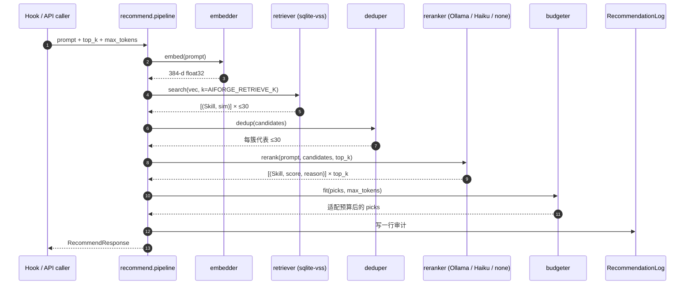

# 推荐管线内部细节（v0.2）

> English: [recommender-internals.en.md](recommender-internals.en.md)
> 关联：[architecture.md](architecture.md) · [extension-spec.md](extension-spec.md) · [README.md](../README.md)

读完这篇你能：

- 解释为什么 AIForge 不是「一段向量检索就完事」
- 在 `server/tests/eval/` 上跑评测、对比 prompt 改动
- 改 reranker / tagger prompt、换 embedder、加自定义后端而不破坏管线
- 知道自动打标和重排为什么共用一套后端但保持独立模块

本文**只覆盖推荐管线 + 自动打标**。Artifact 注册中心、tag CRUD、gateway 见 [architecture.md](architecture.md)。

## 1. 管线总览



每一阶段都是独立模块，可单测、可替换。**自动打标**复用相同的 LLM 后端但跑在 ingest 后台，不在推荐热路径上。

## 2. Embedder

文件：`server/src/aiforge/recommender/embedder.py`

| 维度 | 值 |
|------|----|
| 默认模型 | `sentence-transformers/all-MiniLM-L6-v2` |
| 维度 | 384 |
| 模型体积 | ~90 MB |
| 单条编码 | ~3 ms（CPU） |
| 加载方式 | 进程内单例（`get_embedder()`），首次同步加载并跑一次 warmup 推理 |
| 设备 | `device="cpu"` 显式声明，避免无 GPU 的 VPS 偶发 CUDA 探测 |
| 输出 | L2 归一化的 `np.float32`（强转，避免某些版本返回 float64 与 sqlite-vss 对不齐） |

为什么是 MiniLM-L6：

- 384 维在 [MTEB retrieval](https://huggingface.co/spaces/mteb/leaderboard) 上有非常好的 size/quality 平衡
- 比 L12（768 维）小一半，检索质量只低 2-3 个点
- CPU 跑得动 → $5/月的 VPS 跑得动

什么时候换：

- 多语言为主（中英混用） → `paraphrase-multilingual-MiniLM-L12-v2`
- 库 < 1000 artifact 且追求质量 → `BAAI/bge-small-en-v1.5`
- 库 > 100k → 考虑量化 + 真 ANN（HNSW）

> 换 embedder **必须重建所有 embedding**。两路写入：`Skill.embedding`（打包字节）+ `vss_skills` 虚拟表 rowid，二者要一致。

## 3. Retriever

文件：`server/src/aiforge/recommender/retriever.py`

实现：sqlite-vss 的 `vss_search`，距离函数 cosine。SQL 大致是：

```sql
SELECT rowid, distance
FROM vss_skills
WHERE vss_search(embedding, vss_search_params(:emb, :k));
```

注意两点：

1. **必须用 `vss_search_params(emb, k)` 包装**，否则底层 FAISS 抛 "k > 0" 断言并 SIGABRT（sqlite-vss 0.1.x 的兼容性怪癖）
2. **空索引保护**：FAISS 对 0 向量索引做 k-NN 也会 SIGABRT，所以 `core/db.py:vss_search()` 会先 `SELECT count(*) FROM vss_skills`，为 0 直接返回空列表

`retrieve()` 之后还会：

- 多取 `top_k + len(exclude) + 10` 给 `exclude_ids` 和 inactive 过滤留余量
- 用 raw SQL 把 rowid → skill_id（ORM 不暴露 rowid）
- 通过 ORM 过滤 `is_active=True AND is_approved=True`
- 把 cosine distance 映射成相似度 ∈ [0, 1]

`AIFORGE_RETRIEVE_K=30` 是默认。经验：

| `retrieve_k` | 召回（金标 top-3 在 top-K 里） | rerank 增加耗时 |
|--------------|------------------|--------|
| 10 | < 80% —— 常错失正确答案 | 基线 |
| 30 | > 90% —— 默认 | +0 |
| 50 | > 95% | +300 ms |

## 4. Deduper

文件：`server/src/aiforge/recommender/deduper.py`

为什么需要：库里常有多个"做同一件事"的 artifact —— 三个 review skill、四个 test runner、两个 playwright MCP。如果 reranker 看到 6 个等价候选，它们会一起占满 top-3，浪费上下文。

算法：

1. 在召回的 ≤30 个候选上做 `AgglomerativeClustering(metric="cosine", distance_threshold=0.15)`（≈ cosine_similarity > 0.85 算同簇）
2. 每个簇按下式给候选打分，选最高者：

```
score = 0.5 * sim_to_query
      + 0.3 * log(stars + 1) / log(100_000)   # 截到 [0, 1]，10 万星封顶
      + 0.2 * exp(-ln(2) * age_days / 180)    # 半衰期 180 天
```

3. 给被选中的 skill 写回 `cluster_id`（输入索引），保留输入排序（按 similarity 降序）

输出：≤ 30 个去重后的候选，每簇仅一席。

调优指引：

| 现象 | 调整 |
|------|------|
| "明显应去重的没去" | `_CLUSTER_DISTANCE_THRESHOLD` 0.15 → 0.20 |
| "把不该并的并了" | 0.15 → 0.10 |
| 大库（> 50k） | 改用 HDBSCAN（启动 cost 更高，但 noise 处理更稳） |
| 旧仓库被压制 | 调小 recency 权重（默认 0.2） |
| 小众优质库被压制 | 调小 stars 权重（默认 0.3） |

## 5. Reranker

文件：`server/src/aiforge/recommender/reranker.py`

后端三选一（由 `AIFORGE_RERANKER` 决定）：

| 后端 | 用途 | 延迟 | 质量 |
|------|------|------|------|
| `ollama` | 默认，本地 Qwen2.5-1.5B | ~500 ms（CPU） | 良好 |
| `haiku` | Anthropic API，Claude Haiku | ~400 ms（网络） | 最佳 |
| `none` | 跳过，按 embedding 分排序 | < 5 ms | 一般 |

任何后端失败（HTTP、JSON 解析、超时）→ **静默退回 embedding-only 排序**，响应里 `fallback_used: true`。绝不向上抛异常。

实际 prompt：

```
SYSTEM:
你是一个 skill 路由器的排序助手。用户向 AI 编程 agent 提了一个问题，
你需要从候选 skill 列表里挑出最有帮助的几条。请严格输出 JSON，
不要任何 Markdown 代码块包裹，不要解释。

USER:
用户的问题：
"""
{prompt}    # 截断到前 2000 字符
"""

候选 skill（共 {n} 条，按相似度初排）：
[1] name=<name> | sim=0.87 | desc=<前 160 字符>
[2] name=<name> | sim=0.83 | desc=<前 160 字符>
...

请为每条候选打 0-100 分（100 = 极度相关，0 = 完全无关），并给一句不超过
30 字的中文理由。按相关度从高到低排序，只返回前 {top_k} 条。

返回这个 JSON 结构：
{
  "ranking": [
    {"index": <候选编号，从 1 开始>, "score": <0-100 整数>, "reason": "<中文理由>"}
  ]
}
```

完整源在 `reranker.py:_SYSTEM_PROMPT` / `_USER_PROMPT_TEMPLATE`。

JSON 解析采用**宽松策略**（小模型常带前后文废话）：

1. 先 `json.loads(raw.strip())`
2. 失败则用正则 `\{.*\}` 抓第一个 JSON 对象再 `json.loads`
3. 都失败 → 视为后端失败，触发 fallback

如何评测：

```bash
cd server
uv run pytest tests/eval/ -v
# 跑 100+ 标注 prompt 做回归
```

跟踪指标：

- **top-1 hit rate** —— 金标在 top-1
- **top-3 hit rate** —— 金标在 top-3
- **nDCG@3** —— 排序整体质量

## 6. 自动打标器（v0.2 新增）

文件：`server/src/aiforge/recommender/tagger.py`

**核心约束**：与 reranker 共用 LLM 后端配置（`reranker` / `reranker_model` / `ollama_host` / `anthropic_api_key`），**但代码完全独立**。后端函数 `_call_ollama` / `_call_haiku` 是从 reranker **复制**过来的，避免私有耦合和签名漂移。

### 6.1 触发路径

- `POST /v1/admin/autotag` → `api/autotag.py:_run_job`（后台线程）
- 选 artifact：默认 `only_untagged=True`，跳过已有 `source='auto'` tag 的条目
- 串行处理，调用之间睡眠 50 ms（避免 Ollama 过载），单条超时 3 s
- 候选 tag = `BUILTIN_TAGS` 字典（20 项预置），LLM 只能从其 keys 里挑
- 命中的 tag 通过 `core/tags.add_artifact_tag(source="auto", score=…)` 写库 —— 同函数会按需 upsert 不存在的 tag 行

### 6.2 Prompt（与 reranker 截然不同）

```
SYSTEM:
你是 artifact 分类器。从给定 tag 列表中挑出 1-{N} 个最能描述 artifact 的 tag。
只能从列表里选；不要发明新 tag；不要解释；严格输出 JSON，不要 Markdown 包裹。

USER:
可用 tag 列表（含解释）：
- browser-automation: Playwright/Puppeteer/Selenium 等浏览器自动化
- reverse-engineering: 二进制/协议逆向、反编译、调试器
- ui: 前端界面构建、组件库、设计系统
- ... (20 条)

待分类 artifact：
  name: <name>           # 截断到 128 字符
  description: <description>   # 截断到 400 字符
  摘要: <body 前 600 字符>

请挑出 1-{max_tags} 个最贴切的 tag。返回如下 JSON 结构：
{
  "tags": ["tag1", "tag2"]
}
```

### 6.3 置信度

位置默认衰减表（`_POSITION_SCORES = (1.0, 0.85, 0.7, 0.55, 0.4)`）—— LLM 把"最贴切"的放第一位，第一位拿满分 1.0，往后线性衰减。简单但有效；如需"真实"置信度可改为让 LLM 在 JSON 里返回每项分数。

### 6.4 校验 + 容错

- LLM 返回的 tag 不在 `BUILTIN_TAGS.keys()` → 静默丢弃（小模型偶尔会幻觉）
- 去重 + 截到 `max_tags`
- 任意失败（HTTP、超时、JSON 解析、未知后端、anthropic API error）→ 返回空列表，`logger.warning` 记一行，**绝不抛异常**
- 批处理调用方据空列表决定跳过 —— 一条失败不影响整批

## 7. Token 预算（Budgeter）

文件：`server/src/aiforge/recommender/budgeter.py` 中的逻辑（在 `pipeline.py` 末段实际收敛）。

流程：把 top-K artifact 的 `body` 算近似 token（`len(text) / 4`），累加：

1. ≤ `max_tokens` → 全返
2. 超 → 先丢分数最低的 artifact
3. 仍超 → 截断剩余 body，尾部加 `[...截断，请通过 /v1/artifacts/{id} 获取完整内容]`

token 计数刻意粗略 —— 目的是不让上下文爆掉，精确性不重要。`/4` 在中英文混合 prompt 上经验偏差 ± 15 %，对预算控制够用。

## 8. 审计日志

每次 `/v1/recommend` 都会写一行 `RecommendationLog`（见 `core/models.py`）：

| 字段 | 含义 |
|------|------|
| `prompt_preview` | prompt 前 500 字符（不存全文，省空间 + 部分脱敏） |
| `agent` | 调用方传的 `agent` 字段 |
| `top_k` | 请求的 K |
| `elapsed_ms` | 整管线耗时 |
| `candidates_considered` | retriever 返回数（dedup 前） |
| `fallback_used` | 是否走了 embedding-only |
| `skill_ids` | 最终推荐的 artifact id 列表（JSON 数组） |
| `created_at` | 时间戳（含索引，便于按时间查询） |

常用查询：

```sql
-- 最近 24 小时 fallback 率
SELECT
  SUM(CASE WHEN fallback_used THEN 1 ELSE 0 END) * 1.0 / COUNT(*) AS fallback_rate,
  COUNT(*) AS total
FROM recommendation_logs
WHERE created_at >= datetime('now', '-1 day');

-- 哪些 artifact 被推得最多
SELECT json_each.value AS skill_id, COUNT(*) AS hits
FROM recommendation_logs, json_each(recommendation_logs.skill_ids)
WHERE created_at >= datetime('now', '-7 days')
GROUP BY skill_id
ORDER BY hits DESC
LIMIT 20;

-- p95 延迟（粗略）
SELECT elapsed_ms
FROM recommendation_logs
ORDER BY elapsed_ms
LIMIT 1 OFFSET (SELECT CAST(COUNT(*) * 0.95 AS INTEGER) FROM recommendation_logs);
```

## 9. 性能预算

| 阶段 | p95 目标 |
|------|----------|
| embed | 10 ms |
| retrieve | 20 ms |
| dedup | 30 ms |
| rerank（ollama） | 200 ms |
| rerank（haiku） | 350 ms |
| budget | < 1 ms |
| **总计（ollama）** | **< 300 ms** |
| **fallback（无 rerank）** | **< 80 ms** |

autotag 是离线管线，不计入推荐热路径。100 条 artifact 串行打标约 5 min（Qwen-1.5B CPU）。

## 10. 我想改 / 调优 X，改哪里？

| 目标 | 改这里 |
|------|--------|
| 换 embedder 模型 | `AIFORGE_EMBEDDER_MODEL` + `AIFORGE_EMBEDDER_DIM`，重建索引 |
| 调 retrieve K | `AIFORGE_RETRIEVE_K` |
| 调 dedup 阈值 | `recommender/deduper.py:_CLUSTER_DISTANCE_THRESHOLD` |
| 调 dedup 评分权重 | `deduper.py:_representative_score` |
| 改 rerank prompt | `recommender/reranker.py:_SYSTEM_PROMPT` / `_USER_PROMPT_TEMPLATE` |
| 加新 reranker 后端（vLLM / Together / 自托管） | 在 `reranker.py` 加 `_call_<backend>`，并把分支接入 `rerank()` 的 backend 选择 + 拓展 `Settings.reranker` Literal |
| 改 autotag prompt | `recommender/tagger.py:_SYSTEM_PROMPT` / `_USER_PROMPT_TEMPLATE` |
| 改 autotag 置信度策略 | `tagger.py:_POSITION_SCORES`（或改成 LLM 返回分数） |
| 改 token 计数 | `recommender/budgeter.py:count_tokens`（默认 `len/4`） |
| 推荐慢 | 看 `RecommendationLog.elapsed_ms` 分布；降低 `AIFORGE_RETRIEVE_K`，或换 `AIFORGE_RERANKER=none` |
| 推荐不准 | 跑 `tests/eval/`；常见是 dedup 把对的吃掉了，或 rerank prompt 描述偏离 |

每个阶段都有对应的 `tests/test_{module}.py`；pre-commit hook 强制覆盖率 > 80 %。
